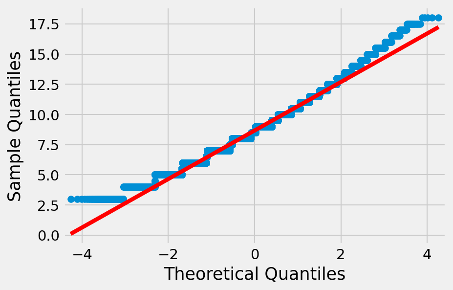
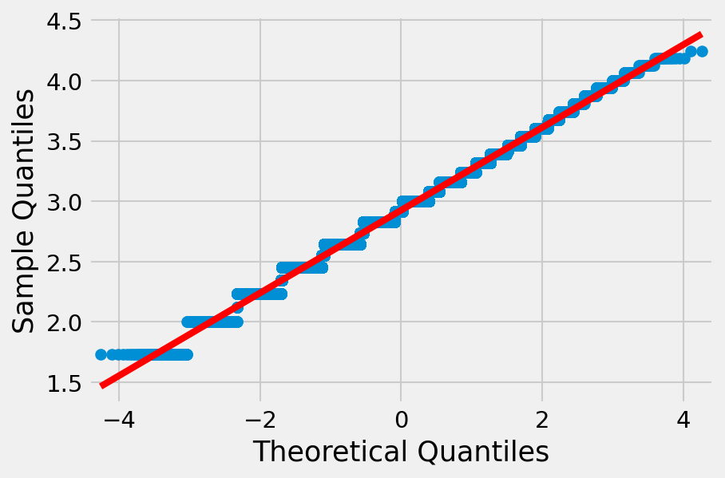
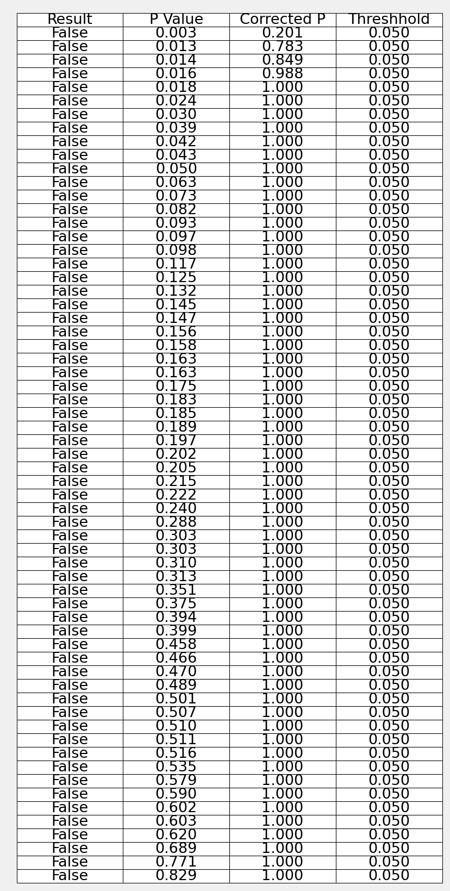

# Evaluating Bias Within Cards Dealt to Players within a Session by the International Skat Server (ISS)
## Overview
Personal observations by players indicated that cards dealt by the International Skat Server (ISS) were not fully random and that certain sessions had sequences of ‘good’ cards, while other sessions had sequences of ‘bad’ cards.

The resulting questions is whether there is a higher occurance of high or low quality cards within a particular session than can be explained by chance alone.

What are high or low quality cards? The quality of a hand in Skat is complex as it depends both on the combination of cards, the type of game that a player could chose with them, the value of that game in bidding vs. the hands of other players, and the skill of the player in recognising all these factors.

## Libraries Used


```python
import issgame
import random
import statsmodels.api as api
import statsmodels.stats.multitest as multitest
import scipy.stats as stats
import numpy
import matplotlib.pyplot as pyplot
pyplot.rcParams['figure.dpi'] = 150
pyplot.rcParams['savefig.dpi'] = 150
```


## Skat Hand Quality
An established approximation of the quality of a skat hand can be obtained by the Stegen Model, used in particular to give training skat players a reference for recognising which games are worth bidding for (https://www.skatfuchs.eu/SB-Kapitel3.pdf):

For a normal suit game (pick highest scoring suit):

+ 1 point per trump
+ 1 point per jack
+ 1 point per trump Ace, 10
+ 1 point per other Ace, 10
+ 0.5 points if player has Jacks of Clubs and Spades
+ or 1.5 points if player has Jacks of Clubs, Spades, and Hearts
+ or 0.5 points if player has Jacks of Spades, Hearts, and Diamonds
+ or 2 points if player has all Jacks
+ 0.5 points per missing suit
+ as player behaviour adjustement that we do not consider (0.5 if opponent does not bid)

A score of 10 or higher is considered good enough to bid.

For a grand game:

+ 1 point per Jack
+ 1 point per Ace, 10

For grands a score of 6 is considered good enough to bid. To make this comparable to the suit score, we can inflate Grand score by 5/3

Based on this we can evaluate the quality of a hand based on the total score of a hand either for a suit or a grand game, whichever is higher.

Stegen does not account for null games, so this analysis does not take into account the quality of cards for a null game.

## Dataset
Two datasets are available from the ISS Server that include over 7 million Skat games played:


```python
!wget -nc https://skatgame.net/iss/iss-games-04-2021.sgf.bz2 -O data/iss-games-04-2021.sgf.bz2
```

    File 'data/iss-games-04-2021.sgf.bz2’ already there; not retrieving.


```python
!bunzip2 -k data/iss-games-04-2021.sgf.bz2
```

    bunzip2: Output file data/iss-games-04-2021.sgf already exists.


We limit our analysis to 2019, 2020, and 2021:


```python
!cat -v data/iss-games-04-2021.sgf | grep "DT\[2019" > data/iss-games-04-2021_2019.sgf
!cat -v data/iss-games-04-2021.sgf | grep "DT\[2020" > data/iss-games-04-2021_2020.sgf
!cat -v data/iss-games-04-2021.sgf | grep "DT\[2021" > data/iss-games-04-2021_2021.sgf
```


```python
with open('data/iss-games-04-2021_2019.sgf') as games_file:
    print(games_file.readline())
```

    (;GM[Skat]PC[International Skat Server]CO[]SE[282933]ID[5557737]DT[2019-01-01/00:00:35/UTC]P0[Cardano]P1[theCount]P2[xskat]R0[0.0]R1[]R2[]MV[w HJ.DT.D7.HQ.DA.CJ.HK.CQ.C7.DQ.CT.DK.C8.S8.SA.SK.SQ.HA.DJ.H8.D8.C9.H7.S7.ST.HT.H9.CK.S9.CA.SJ.D9 1 18 0 y 1 20 0 y 1 22 0 y 1 p 2 p 0 s w SJ.D9 0 G.HK.HQ 0 HJ 1 DJ 2 H7 0 C7 1 CT 2 CA 2 CK 0 CQ 1 C8 2 C9 0 SJ 1 DK 0 DA 1 S8 2 D8 0 DT 1 SQ 2 S7 0 DQ 1 SK 2 H9 0 D9 1 SA 2 S9 0 D7 1 H8 2 HT 0 CJ 1 HA 2 ST ]R[d:0 win v:120 m:3 bidok p:92 t:8 s:1 z:0 p0:0 p1:0 p2:0 l:-1 to:-1 r:0] ;)
    


These datasets contain data points relevant to the analysis:

 + Players involved in a game (*P0\[Montana\]P1\[vaun\]P2\[Ben\]*)
 + Date and time of the game (*DT\[2007-10-29/04:44:01/UTC\]*)
 + Cards dealt to the Skat and players (*HT.ST.DK.HK.CT.* etc.)

The datasets also contain details of the result of bidding and the resulting game, which we do not use for this analysis.

## Extraction and conversion
The datasets use a unique format and contain more information than required, so we extract only the relevant fields from both sets and write them to a clean datasets.


```python
input_filenames = [
    'data/iss-games-04-2021_2019.sgf',
    'data/iss-games-04-2021_2020.sgf',
    'data/iss-games-04-2021_2021.sgf',
]
output_filename = 'data/iss_all_games.tsv'

if not os.path.exists(output_filename):
    issgame.extract_svg_hands(input_filenames, output_filename)

```

This reduces the data to only the required fields by calculating a score for each hand of each player:


```python
with open(output_filename) as games_file:
    line = games_file.readline()
    print(line)
    id_tag, session, player, position, hand_score = line.split('\t')
    print(
        'ID:', id_tag,
        '\nSession:', session,
        '\nPlayer:', player,
        '\nPosition:', position,
        '\nHand Score:', hand_score,
    )

```

    id	session	player	position	hand
    
    ID: id 
    Session: session 
    Player: player 
    Position: position 
    Hand Score: hand
    


For the analysis we will focus on a single plyer (PeterB) and the hands dealt to that plyer. To do this, we further summarise those sessions into a single file:


```python
input_filename = output_filename
issgame.extract_sessions(input_filename, 'PeterB')

```


```python
with open(input_filename[:-4] + '_PeterB.csv') as games_file:
    # print just the first 4 full lines, store the final one as example line
    for i in range(4):
        line = games_file.readline()
        print(line)

    player, session, = line.split(',')[:2]
    hand_scores = line.split(',')[2:]
    # remove newline from final example hand score
    hand_scores[-1] = hand_scores[-1][:-1]
    print(
        '\nPlayer:', player,
        '\nSession:', session,
        '\nHand scores:', hand_scores,
    )
```

    PeterB,2021-01-01-PeterB-kermit-theCount,10.0,8.0,10.0,11.5,8.0,10.0,7.0,8.0,4.0,11.0,9.5,6.0,8.0,8.0,10.0,9.5,6.0,9.0,6.0,9.0,11.667,10.0
    
    PeterB,2021-01-02-PeterB-kermit-theCount,7.0,10.0,9.0,6.0,7.0,9.0,8.0,9.0,7.0,8.5,10.0,8.0
    
    PeterB,2021-01-02-PeterB-bernie-xskat,7.0,9.5,14.0,8.0,8.0,7.0,7.0,6.0,9.0,11.5,8.0,8.0,9.0,11.0,10.0,6.0,12.5,8.5,8.0,7.0,10.0,10.0,7.0,10.5,10.0,10.5,8.0,11.0,10.0,10.5,9.0,9.0
    
    PeterB,2021-01-02-PeterB-theCount-theCount:2,8.0,7.0,7.0,12.5,8.0,8.0,8.0,7.0,10.0,9.5,8.0,8.5,10.0,8.5,8.0,8.0,9.0,9.0,8.5,6.0,10.0
    
    
    Player: PeterB 
    Session: 2021-01-02-PeterB-theCount-theCount:2 
    Hand scores: ['8.0', '7.0', '7.0', '12.5', '8.0', '8.0', '8.0', '7.0', '10.0', '9.5', '8.0', '8.5', '10.0', '8.5', '8.0', '8.0', '9.0', '9.0', '8.5', '6.0', '10.0']


## Session Means Compared
If the hands in a session were particularly good or poor this would be reflected in a high or low mean hand score of that session. To assess whether hands dealt to PeterB in certain sessions, we compare the mean hand score of that session to the mean hand score of all hands played from position 0 on the iss server.

We first load all scores for hands played by PeterB, excluding those sessions with less than 10 hands, since a meaningful comparison cannot be made with such few hands.


```python
player_filename = 'data/iss_all_games_PeterB.csv'
player_hands = issgame.load_sessions(player_filename, 'PeterB')

player_sessions = []
session_n = []
session_count = 0

for session in player_hands['PeterB']:
    # only consider sessions with 10 or more games
    if len(player_hands['PeterB'][session]) >= 10:
        player_sessions.append(session_count)
        session_count += 1
        session_n.append(len(player_hands['PeterB'][session]))
```

We then load all scores for hands played by the player in position 1.


```python
all_hands_filename = 'data/iss_all_games.csv'
all_hands = issgame.load_hands(input_filename, 1)
```

Our default hypothesis that we are atempting to reject is:

+ H0: The mean score of the session is the same as the mean score of overall sample.

So the alternate hypothesis that we can accept, if H0 can be rejected is:

+ HA: The mean score of the session is different from the mean score of the overall sample.

The two populations whose mean hand score we are comparing are:

+ All hands that could be dealt to all players on the ISS server
+ The hands that could be dealt to PeterB in a particular session

Since we do not know the standard deviation of the population and the session sample sizes are low (so we cannot assume normal distribution under CLT) we cannot use a z-test.


```python
print(session_n)
```

    [22, 12, 32, 21, 20, 22, 31, 70, 111, 48, 26, 91, 75, 40, 39, 20, 20, 29, 10, 20, 20, 21, 20, 10, 16, 12, 20, 40, 30, 20, 20, 11, 10, 40, 50, 14, 52, 40, 100, 15, 65, 50, 45, 12, 20, 24, 42, 10, 11]


We also cannot assume that the variance of the sessions and overall sample are the same we cannot use a Student's t-test, so we use an independent two-sample Welch's t-test instead. Since we are testing for equality, we use a two-tailed measure (the session mean could be lower or higher than overall sample mean). The following additional assumptions must be met for this test:

1. The data should be sampled independently

Technically the scores of all hands includes a small number of scores of a particular sessions hands. However, since the sample size of the scores of all hands is several million, this should have no effect and can be neglected.

2. The means of the two populations being compared should follow normal distributions.

A Q-Q plot of a subsample of all hand scores does not appear to be fully normal:


```python
all_hands_sample = []
for i in range(100000):
    all_hands_sample.append(random.choice(all_hands))

all_hands_sample = numpy.array(all_hands_sample)

api.qqplot(all_hands_sample, line='s')
pyplot.show()
```


    

    


Applying a square root transformation to the data corrects for this:


```python
all_hands_sample_sqrt = numpy.sqrt(all_hands_sample)

api.qqplot(all_hands_sample_sqrt, line='s')
pyplot.show()
```


    

    


In order to fulfill the requirement of normality, we transform (by taking the square root) both the dataset of all hands and the dataset of PeterB's sessions.


```python
all_hands = numpy.sqrt(all_hands)
for session in player_hands['PeterB']:
    player_hands['PeterB'][session] = numpy\
        .sqrt(player_hands['PeterB'][session])
```

A repeat of the subsample Q-Q plot for scores of all hands now shows a normal distribution:


```python
all_hands_sample = []
for i in range(100000):
    all_hands_sample.append(random.choice(all_hands))

all_hands_sample = numpy.array(all_hands_sample)

api.qqplot(all_hands_sample, line='s')
pyplot.show()
```


    

    


A Shapiro-Wilk test can be used to test whether the data was drawn from a normal distribution. We perform this test at the 5% confidence level. Since we are testing the same hypothesis (that the overall population of hand scores dealt to PeterB is normal) multiple times, we use the Holm-Bonferroni method to ensure a family-wise error rate of less than 5%.


```python
shwi_ps = []
for session in player_hands['PeterB']:
    # only consider sessions with 10 or more games
    if len(player_hands['PeterB'][session]) >= 10:
        # store p value of Shapiro-Wilk test for each session
        shwi_ps.append(stats.shapiro(numpy.array(
            player_hands['PeterB'][session]))[1]
        )

# sort the p values
shwi_ps.sort()

shwi_multi = multitest\
    .multipletests(shwi_ps, alpha=0.05, method='holm', is_sorted=True)
table_values = []
for i in range(len(shwi_multi[0])):
    table_values.append([
        shwi_multi[0][i],
        format(round(shwi_ps[i], 3), '.3f'),
        format(round(shwi_multi[1][i], 3), '.3f'), "0.050"
    ])

fig, ax = pyplot.subplots()
ax.set_axis_off()
ax.table(cellText=table_values, cellLoc='center',
         colLabels=[
             "Result",
             "P Value",
             "Corrected P",
             "Threshhold",
         ], loc='upper left')
pyplot.show()
```


    

    


We fail to reject the default hypothesis that the population from which the samples were drawn is normally distributed.

Since both the individual session samples and the overall hand score sample show a normal distribution we can proceed with Welch's t-test. Once again, since we are performing multiple tests of the same hypothesis, we apply a Holm-Bonferroni correction.

Since the impact of a type I error is high (unfairly accusing ISS of unfair shuffling), but the sample size within individual sessions is small, we select a 5% significance level.


```python
ttest = []

for session in player_hands['PeterB']:
    # only consider sessions with 10 or more games
    if len(player_hands['PeterB'][session]) >= 10:

        # store p-value of Welch's t-test of difference in mean score between
        # this session and all hands in the datasets
        ttest.append(stats.ttest_ind(
            player_hands['PeterB'][session], all_hands, equal_var=False)[1]
        )

# sort the p values
ttest.sort()

ttest_multi = multitest.multipletests(
    ttest, alpha=0.05, method='holm', is_sorted=True
)
table_values = []
for i in range(len(ttest_multi[0])):
    table_values.append([ttest_multi[0][i], format(
        round(ttest[i], 3), '.3f'),
        format(
            round(ttest_multi[1][i], 3), '.3f'), "0.050"]
    )
fig, ax = pyplot.subplots()
ax.set_axis_off()
ax.table(
    cellText=table_values,
    cellLoc='center',
    colLabels=[
        "Result",
        "P Value",
        "Corrected P",
        "Threshhold",
    ],
    loc='upper left')
pyplot.show()
```


    

    


## Conclusion
We fail to reject the default hypothesis and can conclude that we have found no evidence that the means of the scores of hands dealt to PeterB are different from the means of the scores of all hands dealt by the ISS. Thus there is no evidence that the quality of cards within a particular session differs from the others by more than could by expected due to random chance.

